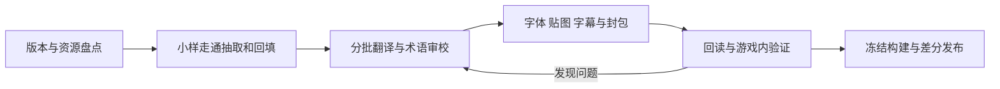

# Game Localization Skill · 游戏汉化工程

一套给 AI 编程助手和汉化团队使用的可复用工作流程，支持 **日文→中文、英文→中文** 及日英混合资源：从版本确认、资源盘点、翻译审校，到字库、贴图、字幕、封包、运行验证和补丁交付。

**这是工程方法与检查工具，不是“一键支持所有游戏”的汉化器。** 首版基于 ACFA、AC4、ACV、高达 UC、水天之泪、ACFF 等项目记录梳理，并参考传统 ROM 汉化和现代本地化工具的一手资料。尚未在所有平台、引擎和新项目上验证。

[阅读 Skill](skills/game-localization/SKILL.md) · [完整流程](skills/game-localization/references/project-workflow.md) · [资料来源](skills/game-localization/references/sources.md) · [下载发行包](https://github.com/AmuroRX-93/game-localization-skill/releases/latest)

## 它解决什么

- 把所有已发现资源和未知区域列清楚，防止“正文翻完了”掩盖按钮贴图、更新资源和过场漏译。
- 日文或英文原文／中文按稳定 ID 对照，术语有来源，校对意见可回写。
- 将译义、字码、字形和排版问题分开处理，避免修译文却修错层。
- 保护指针、控制码、资源键、图集边界和运行时内存预算。
- 将文件通过、写入通过、实际运行通过、发布成功分别记录。
- 为原版安装、旧汉化升级和回退提供清楚的交付要求。



## 安装和使用

**推荐下载总包：[game-localization-all-v0.3.0.zip](https://github.com/AmuroRX-93/game-localization-skill/releases/download/v0.3.0/game-localization-all-v0.3.0.zip)**。解压后按工具选择 Codex、Cursor、Kimi Code、Qwen Code 或 CodeBuddy 文件夹，每份都有「先看这里.md」。不用分别下载，也不要把整个总包安装到技能目录。

**Cursor 用户：** 下载 `game-localization-cursor-v0.3.0.zip`，按包内 `先看这里.md` 将技能放到项目的 `.cursor/skills/`，在 Agent 中用 `/game-localization` 调用。[Cursor 安装说明](docs/CURSOR.md) · [国产工具与兼容范围](docs/COMPATIBILITY.md)

**Codex 或其他工具：**

下载 Release 中的 `game-localization-v0.3.0.zip`，解压，将整个 `game-localization` 文件夹放到你的技能目录；Codex 通常是 `~/.codex/skills/`，配置了 `CODEX_HOME` 时使用其中的 `skills/`。已有同名技能先比较差异，不直接覆盖定制版。开始新任务后调用：

> 使用 $game-localization 处理这个游戏的汉化。先核对版本和已有工程，列出文本、字体、贴图、字幕与未解析资源，再做一个能回填验证的小样。

局部工作也可直接说：

> 使用 $game-localization 审核现有补丁，只修按键说明缺字，保留画面和手柄设置。

其他支持文件型 Skill 的助手可加载 `SKILL.md` 并保留整个目录；不支持 Skill 的工具或人工团队可直接参考文档。没有绑定特定模型、云服务、操作系统或付费翻译 API。

## 可执行检查

覆盖清单工具仅依赖 Python 3.9+：

```sh
python3 skills/game-localization/scripts/audit_ledger.py project-ledger.json
```

[清单格式](skills/game-localization/references/ledger.md) · [虚构示例](skills/game-localization/references/demo-ledger.json)

它能发现重复 ID、丢失条目、未解析资源、无依据的审校通过、token 丢失／错序、旧构建测试等问题，并区分物理条目与唯一字符串。示例故意含待办，退出码为 1。工具不会自动识别游戏文件，也不会验证证据真假或宣称全游戏无遗漏。

```sh
python3 -m unittest discover -s tests -v
```

19 项自动测试通过；具体边界见 [验证记录](VALIDATION.md)。

## 仓库结构

- `skills/game-localization/`：可直接安装的 Skill、专项参考和清单检查脚本。
- `docs/`：Cursor 安装说明、国产工具与兼容性边界。
- `tools/build_packages.py`：从同一份源文件生成五种工具包与一个总包，执行 `python3 tools/build_packages.py`。
- `tests/`：检查脚本的合成数据测试；不需要任何游戏文件。
- `VALIDATION.md`：本版实际验证范围和场景审查。

通用方法和游戏专用适配器分开。新增适配器请说明支持版本、输入指纹、解析／写回约束、往返结果和运行证据；不要仅以“同引擎”宣称兼容。

## 来源与分享

感谢传统汉化工具、原汉化团队和开源本地化工具积累的方法。具体参考及适用限制见[资料来源](skills/game-localization/references/sources.md)，项目经验见[案例](skills/game-localization/references/case-notes.md)。本仓库未复制私人聊天、游戏二进制、译文全集、商业字体、BIOS 或存档。

本仓库原创文档和代码采用 MIT 许可；第三方资料及游戏资产不受此许可覆盖。使用此 Skill 不代表自动获得第三方作品分发许可。

## English summary

A reusable Japanese-to-Chinese and English-to-Chinese game localization engineering skill for AI assistants and fan-translation teams. Includes a native Cursor skill package generated from the same source. It covers inventory, terminology, extraction/reinsertion, legacy fonts, UI textures, subtitles, memory constraints, runtime QA and releases. It is a methodology with a read-only ledger auditor, not a universal game parser. Format-specific adapters must be validated per game/version. The primary documentation is in Chinese; the auditor uses English field names and diagnostics.
